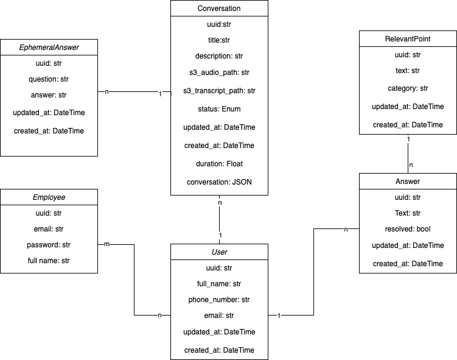

# Portal de conversaciones

👋 ¡Bienvenidos a nuestro proyecto! 

## Descripción del proyecto

### 🤔 Problema
La Cruz Roja se enfrenta al problema de que los procesos de acogida y valoración, realizados como primer contacto con un usuario a través de entrevistas y formularios específicos, pueden ser largos y fríos, lo que puede afectar negativamente la experiencia del usuario y reducir su participación en los programas y servicios de la ONG. Para mejorar la eficiencia de este proceso y crear un primer contacto más cálido y acogedor, Cruz Roja busca una solución innovadora que automatice el proceso de acogida y valoración y permita a los entrevistadores obtener los beneficios de una mejor atención sin tener que completar formularios. 

### 💡 Solución

Para abordar el problema de eficiencia en el proceso de valoración, hemos creado una solución innovadora llamada "Portal de conversaciones". Esta plataforma es una herramienta de software basada en la nube, alojada en Amazon Web Services (AWS), que permite a los entrevistadores de Cruz Roja realizar la valoración de los usuarios sin tener que llenar formularios, lo que reduce significativamente el tiempo necesario para completar el proceso.

La plataforma utiliza tecnologías como Transcribe, OpenAI i Deepgram para analizar y procesar los datos de la entrevista y generar un informe detallado del usuario. Además, la plataforma ofrece una interfaz visual intuitiva para que los entrevistadores puedan interactuar con los resultados de la valoración y hacer un seguimiento de los usuarios a lo largo del tiempo.

El "Portal de conversaciones" es una solución innovadora ya que puede procesar en tiempo real una conversación y marcar los puntos clave o preguntas que ya se han hablado en ese momento. Además, gracias a su diseño modular, la plataforma puede adaptarse fácilmente a las necesidades específicas de la Cruz Roja y puede extenderse a otras aplicaciones.

## Table of Contents

- [Portal de conversaciones](#portal-de-conversaciones)
  - [Descripción del proyecto](#descripción-del-proyecto)
    - [🤔 Problema](#-problema)
    - [💡 Solución](#-solución)
  - [Table of Contents](#table-of-contents)
  - [Diagrama de Arquitectura](#diagrama-de-arquitectura)
  - [Descripción técnica](#descripción-técnica)
    - [Software](#software)
      - [Repositorios](#repositorios)
      - [Diagrama relacional](#diagrama-relacional)
      - [🔧 Funcionalidades](#-funcionalidades)
        - [1. Iniciar sesión](#1-iniciar-sesión)
        - [2. Modificar mi perfil](#2-modificar-mi-perfil)
        - [3. Añadir un usuario](#3-añadir-un-usuario)
        - [4. Ordenar usuarios](#4-ordenar-usuarios)
        - [5. Subir conversación](#5-subir-conversación)
        - [6. Ver transcripción](#6-ver-transcripción)
        - [7. Saber más](#7-saber-más)
        - [8. Reproducir conversación](#8-reproducir-conversación)
        - [9. Ficha de usuario](#9-ficha-de-usuario)
        - [10. Grabar conversación](#10-grabar-conversación)
        - [11. Buscador](#11-buscador)
        - [12. Ver notificaciones](#12-ver-notificaciones)
    - [Arquitectura Cloud AWS](#arquitectura-cloud-aws)
      - [Descripción](#descripción)
      - [Repositorios](#repositorios-1)
  - [⏭️ Demo](#️-demo)
  - [👥 Team Members](#-team-members)
  - [⏭️ Trabajo futuro](#️-trabajo-futuro)
  - [🎉 Conclusión](#-conclusión)

## Diagrama de Arquitectura

## Descripción técnica

### Software

#### Repositorios

- [Frontend](https://github.com/JPG-squad/front) 

- [Backend](https://github.com/JPG-squad/back)

- [Research IA ( Not used )](https://github.com/JPG-squad/back)
  

#### Diagrama relacional

A continuación, se muestra el diagrama relacional de los modelos de la base de datos utilizados en la plataforma:

#### 🔧 Funcionalidades

A continuación, se enumeran todas las funcionalidades que ofrece el Portal de conversaciones:

- [Portal de conversaciones](#portal-de-conversaciones)
  - [Descripción del proyecto](#descripción-del-proyecto)
    - [🤔 Problema](#-problema)
    - [💡 Solución](#-solución)
  - [Table of Contents](#table-of-contents)
  - [Diagrama de Arquitectura](#diagrama-de-arquitectura)
  - [Descripción técnica](#descripción-técnica)
    - [Software](#software)
      - [Repositorios](#repositorios)
      - [Diagrama relacional](#diagrama-relacional)
      - [🔧 Funcionalidades](#-funcionalidades)
        - [1. Iniciar sesión](#1-iniciar-sesión)
        - [2. Modificar mi perfil](#2-modificar-mi-perfil)
        - [3. Añadir un usuario](#3-añadir-un-usuario)
        - [4. Ordenar usuarios](#4-ordenar-usuarios)
        - [5. Subir conversación](#5-subir-conversación)
        - [6. Ver transcripción](#6-ver-transcripción)
        - [7. Saber más](#7-saber-más)
        - [8. Reproducir conversación](#8-reproducir-conversación)
        - [9. Ficha de usuario](#9-ficha-de-usuario)
        - [10. Grabar conversación](#10-grabar-conversación)
        - [11. Buscador](#11-buscador)
        - [12. Ver notificaciones](#12-ver-notificaciones)
    - [Arquitectura Cloud AWS](#arquitectura-cloud-aws)
      - [Descripción](#descripción)
      - [Repositorios](#repositorios-1)
  - [⏭️ Demo](#️-demo)
  - [👥 Team Members](#-team-members)
  - [⏭️ Trabajo futuro](#️-trabajo-futuro)
  - [🎉 Conclusión](#-conclusión)

##### 1. Iniciar sesión
La funcionalidad de inicio de sesión es la primera en la plataforma, permitiendo a los usuarios acceder a su cuenta a través de su correo electrónico y contraseña registrados previamente. Estos datos deben estar almacenados en nuestra base de datos como un "Empleado".

[link demo login]

##### 2. Modificar mi perfil
Esta funcionalidad te permite actualizar la información de tu cuenta en la plataforma. Para acceder a esta funcionalidad, haz clic en el icono de tu perfil ubicado en la esquina superior derecha de la pantalla. Verás que aparecerá un menú desplegable con varias opciones, entre ellas "Editar mi perfil". Al seleccionar esta opción, podrás editar tus datos personales, por ahora solo tu nombre. También puedes cerrar sesión desde este mismo menú.

La funcionalidad ahora mismo no tiene mucho sentido pero esta pensada por si en un futuro un empleado tiene más campos editables.

[link demo modificar mi perfil y logout]

##### 3. Añadir un usuario
Para empezar una conversación, es necesario añadir un usuario. En la parte izquierda de la plataforma, encontrarás el listado de usuarios y podrás agregar uno nuevo. Solo necesitas introducir su nombre y correo electrónico, y opcionalmente, su número de teléfono. Cuando agregues al usuario, aparecerá en la parte superior de la lista y podrás comenzar una conversación con él o ella desde la parte derecha de la plataforma.

[link demo añadir usuario]

##### 4. Ordenar usuarios
En la sección de listado de usuarios, encontrarás diversas opciones para ordenarlos y facilitar su búsqueda. Podrás ordenarlos alfabéticamente o por el grado de interacción con ellos. Esto te permitirá encontrar rápidamente al usuario con el que quieres conversar y mejorar la eficiencia de tus interacciones en la plataforma.

[link demo filtrar usuarios]

##### 5. Subir conversación

Una vez seleccionado un usuario, verás un botón rojo con un icono de "+" en la parte inferior derecha de la plataforma. Al pulsar este botón, se abrirán dos opciones. 

La primera opción te permitirá subir una conversación en múltiples formatos, como Wav, Mp3 y Webm. Además, podrás seleccionar el modelo de inteligencia artificial que procesará la conversación. 

Por ahora, puedes escoger entre AWS Transcribe y Deepgram. Mientras se procesa la conversación, verás un mensaje de carga en la parte inferior central de la plataforma. Una gran ventaja de nuestra plataforma es que podrás seguir navegando e interactuando con ella mientras se procesa la conversación. 

Una vez se haya procesado con éxito, aparecerá un mensaje y una notificación. La conversación se situará arriba del todo en la lista de conversaciones de ese usuario, ya que por defecto están ordenadas por orden de creación. Se habrá generado automáticamente un título identificativo y una descripción breve para esa conversación. 

Además, habrá tres botones que explicaremos más adelante en otras funcionalidades. 

Si esta es la primera conversación, también se generará automáticamente una ficha de usuario, de la cual hablaremos más adelante.

[link demo subir conversación]

##### 6. Ver transcripción
En la carta de una conversación verás una serie de botones en la parte inferior. El primer botón, te permitirá ver la transcripción generada por el modelo de inteligencia artificial que has seleccionado al subir la conversación. La transcripción se mostrará en un formato de chat, donde podrás ver el diálogo que ha tenido lugar durante la conversación. Este formato hace que la transcripción sea más fácil de leer y comprender, permitiendo al usuario identificar rápidamente lo que se ha dicho en cada momento.

[link demo ver transcripción]

##### 7. Saber más
Al lado del botón para ver la transcripción, verás otro botón con el texto "Saber más". Al hacer clic en él, se abrirá una ventana emergente con un campo de texto en el que puedes escribir cualquier pregunta relacionada con la conversación o cualquier detalle que se te haya pasado durante la entrevista. Una vez hayas escrito alguna pregunta, va a aparecer una respuesta en pocos segundos.

Esta funcionalidad te permite asegurarte de que no se te escapa ningún detalle importante y te permite revivir cualquier pregunta que hayas hecho durante la entrevista para recordar las respuestas del usuario.

Además, esta funcionalidad es muy versátil y te permite hacer cualquier tipo de pregunta en el momento. Todo lo que tienes que hacer es escribir la pregunta en el campo de texto y presionar "Enter". Así de fácil.

[link demo preguntas efímeras]

##### 8. Reproducir conversación
Si bien la transcripción es una herramienta útil, en ocasiones puede haber errores o inexactitudes en el texto generado por los modelos de inteligencia artificial. Para evitar esto, nuestra plataforma ofrece la funcionalidad de reproducir la conversación original con el usuario. Cada conversación cuenta con un botón de reproducción en la parte superior derecha. 

Al hacer clic en él, se desplegará un reproductor de audio en la parte inferior central de la pantalla. Desde allí, podrás avanzar o retroceder en la conversación, pausarla y reanudarla sin ningún problema. La gran ventaja de esta funcionalidad es que puedes tener la conversación reproduciéndose mientras realizas otras tareas en la plataforma, como revisar la transcripción o editar la ficha del usuario. De esta manera, tendrás acceso a la fuente original y podrás asegurarte de que la información que manejas es precisa y completa.

[link demo reproductor]

##### 9. Ficha de usuario

##### 10. Grabar conversación

##### 11. Buscador

##### 12. Ver notificaciones

### Arquitectura Cloud AWS

#### Descripción

#### Repositorios

- [Terraform](https://github.com/JPG-squad/terraform) 

## ⏭️ Demo

## 👥 Team Members

## ⏭️ Trabajo futuro

## 🎉 Conclusión