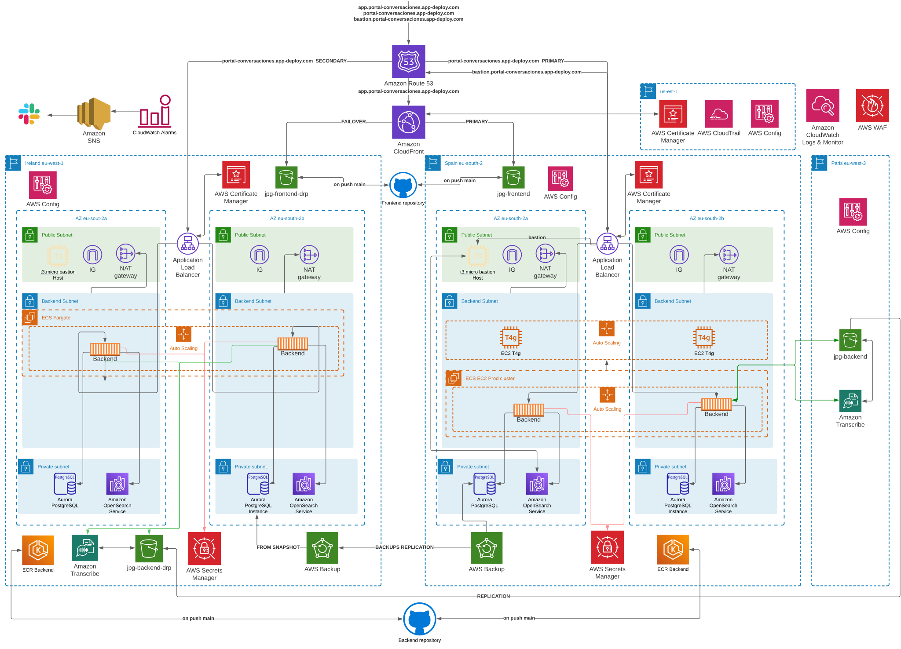
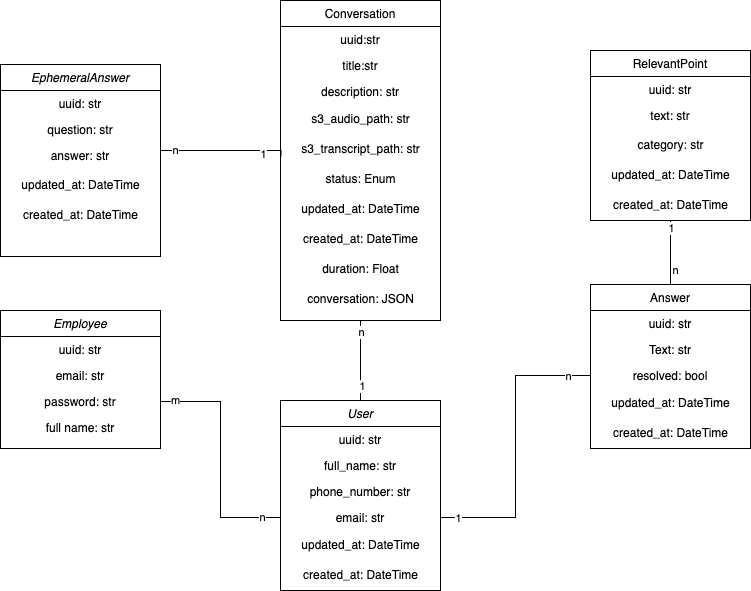
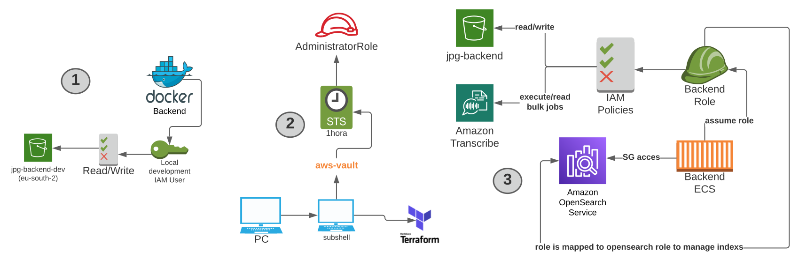
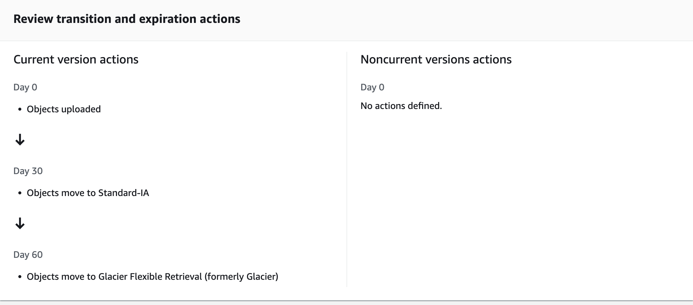
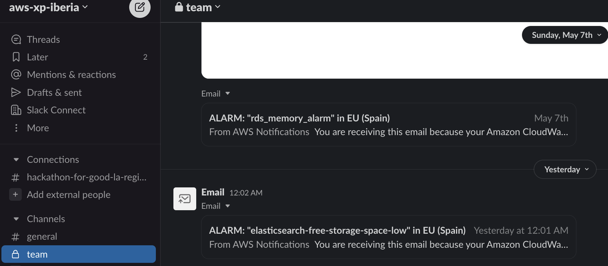
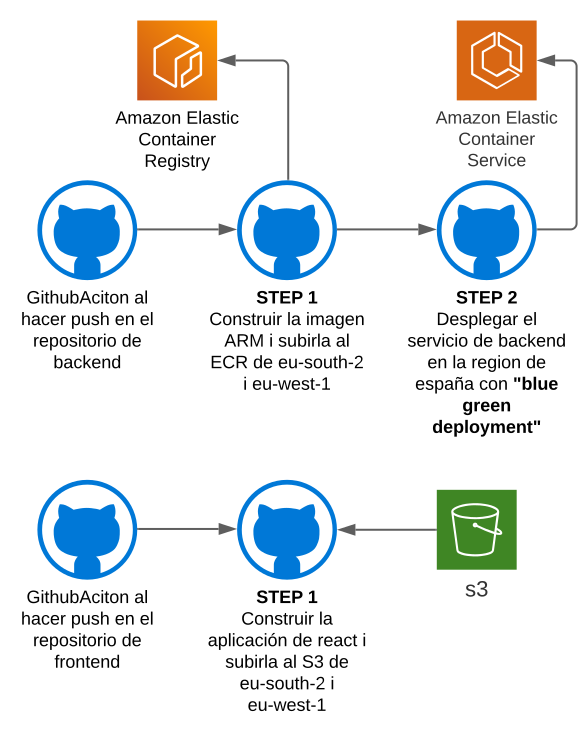
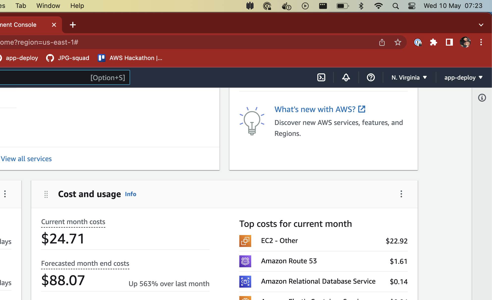
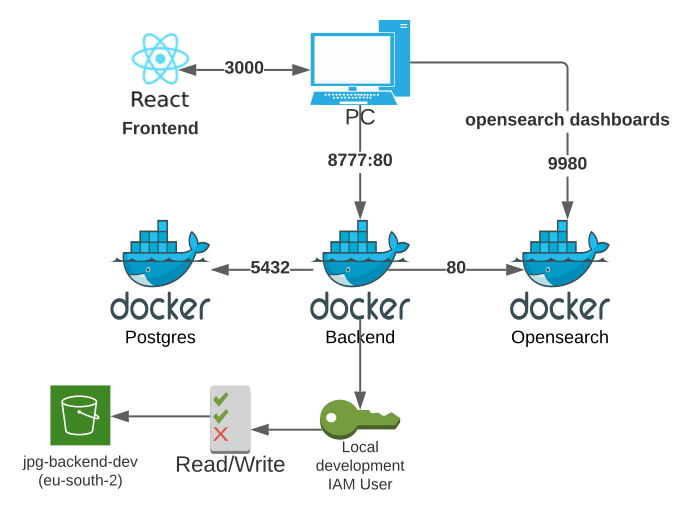

# Portal de conversaciones

👋 ¡Bienvenidos a nuestro proyecto! 

## Descripción del proyecto

### 🤔 Problema
La Cruz Roja se enfrenta al problema de que los procesos de acogida y valoración, realizados como primer contacto con un usuario a través de entrevistas y formularios específicos, pueden ser largos y fríos, lo que puede afectar negativamente la experiencia del usuario y reducir su participación en los programas y servicios de la ONG. Para mejorar la eficiencia de este proceso y crear un primer contacto más cálido y acogedor, Cruz Roja busca una solución innovadora que automatice el proceso de acogida y valoración y permita a los entrevistadores obtener los beneficios de una mejor atención sin tener que completar formularios. 

### 💡 Solución

Para abordar el problema de eficiencia en el proceso de valoración, hemos creado una solución innovadora llamada "Portal de conversaciones". Esta plataforma es una herramienta de software basada en la nube, alojada en Amazon Web Services (AWS), que permite a los entrevistadores de Cruz Roja realizar la valoración de los usuarios sin tener que llenar formularios, lo que reduce significativamente el tiempo necesario para completar el proceso.

La plataforma utiliza tecnologías como Transcribe, OpenAI i Deepgram para analizar y procesar los datos de la entrevista y generar un informe detallado del usuario. Además, la plataforma ofrece una interfaz visual intuitiva para que los entrevistadores puedan interactuar con los resultados de la valoración y hacer un seguimiento de los usuarios a lo largo del tiempo.

El "Portal de conversaciones" es una solución innovadora ya que puede procesar en tiempo real una conversación y marcar los puntos clave o preguntas que ya se han hablado en ese momento. Además, gracias a su diseño modular, la plataforma puede adaptarse fácilmente a las necesidades específicas de la Cruz Roja y puede extenderse a otras aplicaciones.

## Table of Contents

- [Portal de conversaciones](#portal-de-conversaciones)
  - [Descripción del proyecto](#descripción-del-proyecto)
    - [🤔 Problema](#-problema)
    - [💡 Solución](#-solución)
  - [Table of Contents](#table-of-contents)
  - [Diagrama de Arquitectura](#diagrama-de-arquitectura)
  - [Descripción técnica](#descripción-técnica)
    - [Software](#software)
      - [Repositorios](#repositorios)
      - [Diagrama relacional](#diagrama-relacional)
      - [🔧 Funcionalidades](#-funcionalidades)
        - [1. Iniciar sesión](#1-iniciar-sesión)
        - [2. Modificar mi perfil](#2-modificar-mi-perfil)
        - [3. Añadir un usuario](#3-añadir-un-usuario)
        - [4. Ordenar usuarios](#4-ordenar-usuarios)
        - [5. Subir conversación](#5-subir-conversación)
        - [6. Ver transcripción](#6-ver-transcripción)
        - [7. Saber más](#7-saber-más)
        - [8. Reproducir conversación](#8-reproducir-conversación)
        - [9. Ficha de usuario](#9-ficha-de-usuario)
        - [10. Grabar conversación](#10-grabar-conversación)
        - [11. Buscador](#11-buscador)
        - [12. Ver notificaciones](#12-ver-notificaciones)
    - [Arquitectura Cloud](#arquitectura-cloud)
      - [Descripción](#descripción)
      - [Repositorios](#repositorios-1)
      - [AWS Services](#aws-services)
        - [EC2, ECS, ECR, Fargate, ALB](#ec2-ecs-ecr-fargate-alb)
        - [Transcribe](#transcribe)
        - [Aurora RDS](#aurora-rds)
        - [Opensearch](#opensearch)
        - [IAM](#iam)
        - [S3](#s3)
        - [Cloudfront](#cloudfront)
        - [Cloudwatch, SNS](#cloudwatch-sns)
        - [ACM](#acm)
        - [Route53](#route53)
        - [Backups](#backups)
        - [Config](#config)
        - [Cloudtrail](#cloudtrail)
      - [Recuperación de desastres](#recuperación-de-desastres)
        - [Politica de backups](#politica-de-backups)
        - [DRP Test](#drp-test)
        - [MTTR ( Mean Time To Recover )](#mttr--mean-time-to-recover-)
      - [AWS Pilars](#aws-pilars)
        - [Excelencia operativa](#excelencia-operativa)
        - [Seguridad](#seguridad)
        - [Fiabilidad](#fiabilidad)
        - [Eficiencia del rendimiento](#eficiencia-del-rendimiento)
        - [Optimización de costos](#optimización-de-costos)
        - [Sostenibilidad](#sostenibilidad)
      - [CI/CD](#cicd)
      - [Costes](#costes)
  - [Local development](#️-local-development)
  - [GDPR](#gdpr)
  - [🎥 Demo](#️-demo)
  - [👥 Team Members](#-team-members)
  - [⏭️ Trabajo futuro](#️-trabajo-futuro)
  - [🎉 Conclusión](#-conclusión)

## Diagrama de Arquitectura

## Descripción técnica

### Software

#### Repositorios

- [Frontend](https://github.com/JPG-squad/front) 

- [Backend](https://github.com/JPG-squad/back)

- [Research IA ( Not used )](https://github.com/JPG-squad/back)
  

#### Diagrama relacional

A continuación, se muestra el diagrama relacional de los modelos de la base de datos utilizados en la plataforma:

#### 🔧 Funcionalidades

A continuación, se enumeran todas las funcionalidades que ofrece el Portal de conversaciones:

- [1. Iniciar sesión](#1-iniciar-sesión)
- [2. Modificar mi perfil](#2-modificar-mi-perfil)
- [3. Añadir un usuario](#3-añadir-un-usuario)
- [4. Ordenar usuarios](#4-ordenar-usuarios)
- [5. Subir conversación](#5-subir-conversación)
- [6. Ver transcripción](#6-ver-transcripción)
- [7. Saber más](#7-saber-más)
- [8. Reproducir conversación](#8-reproducir-conversación)
- [9. Ficha de usuario](#9-ficha-de-usuario)
- [10. Grabar conversación](#10-grabar-conversación)
- [11. Buscador](#11-buscador)
- [12. Ver notificaciones](#12-ver-notificaciones)

##### 1. Iniciar sesión
La funcionalidad de inicio de sesión es la primera en la plataforma, permitiendo a los usuarios acceder a su cuenta a través de su correo electrónico y contraseña registrados previamente. Estos datos deben estar almacenados en nuestra base de datos como un "Empleado".

**Implementación técnica**
> El sistema de autenticación es un sistema senzillo, con un **token** que se almacena en la base de datos y se envia al cliente para que lo almacene en el **local storage**. Este token se envia en cada peticion al backend para que este pueda identificar al usuario. Este token se genera cuando el usuario introduce correctamente su usuario y contrasenya, y se eliminia al cerrar sesión.

##### 2. Modificar mi perfil
Esta funcionalidad te permite actualizar la información de tu cuenta en la plataforma. Para acceder a esta funcionalidad, haz clic en el icono de tu perfil ubicado en la esquina superior derecha de la pantalla. Verás que aparecerá un menú desplegable con varias opciones, entre ellas "Editar mi perfil". Al seleccionar esta opción, podrás editar tus datos personales, por ahora solo tu nombre. También puedes cerrar sesión desde este mismo menú.

La funcionalidad ahora mismo no tiene mucho sentido pero esta pensada por si en un futuro un empleado tiene más campos editables.

**Implementación técnica**
> Para modificar el perfil, el usuario dispone de una model dónde permitimos cambiar los campos que són ediatables del model del trabajador de la Cruz Roja. Para ello, se hace una petición al backend con los datos del usuario y se actualizan en la base de datos.

##### 3. Añadir un usuario
Para empezar una conversación, es necesario añadir un usuario. En la parte izquierda de la plataforma, encontrarás el listado de usuarios y podrás agregar uno nuevo. Solo necesitas introducir su nombre y correo electrónico, y opcionalmente, su número de teléfono. Cuando agregues al usuario, aparecerá en la parte superior de la lista y podrás comenzar una conversación con él o ella desde la parte derecha de la plataforma.

**Implementación Técnica**
> Un trabajador de la cruz roja añade un nueve paciente des de la modal que se muestra en en frontend. Luego, estos datos sirven para crear una nueva instancia del model que representa a un usuario en la base de datos. Este usuario queda enlazado con el trabajador de la cruz roja.

##### 4. Ordenar usuarios
En la sección de listado de usuarios, encontrarás diversas opciones para ordenarlos y facilitar su búsqueda. Podrás ordenarlos alfabéticamente o por el grado de interacción con ellos. Esto te permitirá encontrar rápidamente al usuario con el que quieres conversar y mejorar la eficiencia de tus interacciones en la plataforma.

**Implementación Técnica**
> Des del frontend, somos capaces de ordenar el listado de usuarios por dos criterios: aflabéticamente y por "**frecuencia de interacción**" (dónde el último usuario con el que se ha hecho una acción se muestra arriba o abajo, dependiendo de la ordenación). Para la ordenación alfabética, lo hace puramente el frontend. Para la ordenación por interacción, se utiliza el campo *updated_at* de la base de datos del model usuario. Este campo se actualiza cada vez que se hace una acción con este.

##### 5. Subir conversación

Una vez seleccionado un usuario, verás un botón rojo con un icono de "+" en la parte inferior derecha de la plataforma. Al pulsar este botón, se abrirán dos opciones. 

La primera opción te permitirá subir una conversación en múltiples formatos, como Wav, Mp3 y Webm. Además, podrás seleccionar el modelo de inteligencia artificial que procesará la conversación. 

Por ahora, puedes escoger entre AWS Transcribe y Deepgram. Mientras se procesa la conversación, verás un mensaje de carga en la parte inferior central de la plataforma. Una gran ventaja de nuestra plataforma es que podrás seguir navegando e interactuando con ella mientras se procesa la conversación. 

Una vez se haya procesado con éxito, aparecerá un mensaje y una notificación. La conversación se situará arriba del todo en la lista de conversaciones de ese usuario, ya que por defecto están ordenadas por orden de creación. Se habrá generado automáticamente un título identificativo y una descripción breve para esa conversación. 

Además, habrá tres botones que explicaremos más adelante en otras funcionalidades. 

Si esta es la primera conversación, también se generará automáticamente una ficha de usuario, de la cual hablaremos más adelante.

**Implementación Técnica**
> Para subir una conversación, el usuario selecciona un archivo y lo sube utilizando el botón de subir conversación. En este momento, el front comprueba que el fichero es un fichero de audio y de alguno de los formatos que soportamos. Además, el usuario puede elegir qué modelo de **IA** desea utilitzar para transcribir la conversación. Tanto el fichero como este parámetro son pasados al backend para hacer la acción de subir la conversación (uno como datos del POST y el otro como query parameter).    
> Una vez el backend recibe la petición, la manda para transcribir a la inteligiencia artificial seleccionada: **AWS Transcribe** o **Deepgram** (siendo **AWS Transcribe** la que se utiliza por defecto porque ha sido la que nos da mejor resultados de diarización). Cuando esta termina, el backend recibe la transcripción. Esta es una implementación dónde el backend espera mientras se va procesando, haciendo **POLLING** para ver cuando está. La implementación concreta de cada modelo utilizado se puede ver en el código, así como los parametros utilizados para cada uno (que han sido el resultado de hacer pruebas e ir refinandolo). En ambas, pedimos que la IA haga diagnóstico de los hablantes, para poder identificarlos en la transcripción (*diarization*).    
> Una vez recibida la respuesta, se trata el resultado según el formato de salida que nos devuelve, y creamos una **estructura en forma de chat**, construyendo frases intercaladas entre los hablantes que hayan en la conversación.    
> Después, con esta transcirpción que hemos generado, **intentamos responder las preguntas del formulario** que tenemos el objetivo de rellenar (la "*ficha de usuario*", como lo llamamos nosotros). Para hacerlo, utilizamos dos funciones que hemos creado, que utilizan **ChatGPT de OpenAI** para intentar determinar dos coses: si se han respondido o no las preguntas y, para las que sí que detecta que se ha hablado o respondido, que genere una respuesta. Con esto, guardamos este "**checklist**" de lo respondido en modelos de la base de datos, donde guardamos las repspuestas para este usuario (que nos serviran para crear la ficha de usuario).    
> Por último, también utilizamos el **ChatGPT** para generar un **título** y **descripción** automáticos para la conversación, que es lo que terminamos devolviendo en la llamada del frontend.

##### 6. Ver transcripción
En la carta de una conversación verás una serie de botones en la parte inferior. El primer botón, te permitirá ver la transcripción generada por el modelo de inteligencia artificial que has seleccionado al subir la conversación. La transcripción se mostrará en un formato de chat, donde podrás ver el diálogo que ha tenido lugar durante la conversación. Este formato hace que la transcripción sea más fácil de leer y comprender, permitiendo al usuario identificar rápidamente lo que se ha dicho en cada momento.

**Implementación Técnica**
> Cuándo el usario pulsa sobre el botón de transcripción de una conversación, se hace una llamada al backend indicando de que usuario y qué conversación concreta se quiere la transcripción. Esta transcripción puede ser el resultado de una conversación grabada en tiempo real desde nuestra apliación (que se explica en el punto 10) o bien una conversación que se ha subido a la plataforma en forma de fichero de audio (que se explica en el punto 5).    
> El backend simplemente devuelve lo que tiene almazenado de esta conversación el campo de transcripción (que es un campo json), que es el campo que rellenamos después de haber procesado las conversaciones y formateado en forma de chat (un array de objetos json, dónde cada objeto tiene dos campos: el texto y el hablante).    

##### 7. Saber más
Al lado del botón para ver la transcripción, verás otro botón con el texto "Saber más". Al hacer clic en él, se abrirá una ventana emergente con un campo de texto en el que puedes escribir cualquier pregunta relacionada con la conversación o cualquier detalle que se te haya pasado durante la entrevista. Una vez hayas escrito alguna pregunta, va a aparecer una respuesta en pocos segundos.

Esta funcionalidad te permite asegurarte de que no se te escapa ningún detalle importante y te permite revivir cualquier pregunta que hayas hecho durante la entrevista para recordar las respuestas del usuario.

Además, esta funcionalidad es muy versátil y te permite hacer cualquier tipo de pregunta en el momento. Todo lo que tienes que hacer es escribir la pregunta en el campo de texto y presionar "Enter". Así de fácil.

**Implementación Técnica**
> Cuándo el usuario utiliza la funcionalidad de saber más, se hace una llamada pasando el "*prompt*" o pregunta que el usario quiere saber sobre una determinada conversación. Cuándo el backend lo recibe, recupera la trascripción de la conversación sobre la que se está preguntado, que nos sirve como contexto para poder responder.    
> Luego, con el contexto y la pregunta, se utiliza **ChatGPT** para responderla. Se le pasa toda la transcripción y, además, añadimos un prompt adicional nosotros para mejorar el tipo de respuestas que hace (que han sido resultado de ir haciendo pruebas y refinando). Una vez hemos respondido la pregunta, se devuelve el resultado al frontend, después de haber guardado este en la base de datos, de tal forma que la próxima vez que el usuario entre en la sección de ver más de esta misma conversación, va a ver lo que ya había preguntado anteriormente para que no lo tenga que volver a preguntar.

##### 8. Reproducir conversación
Si bien la transcripción es una herramienta útil, en ocasiones puede haber errores o inexactitudes en el texto generado por los modelos de inteligencia artificial. Para evitar esto, nuestra plataforma ofrece la funcionalidad de reproducir la conversación original con el usuario. Cada conversación cuenta con un botón de reproducción en la parte superior derecha. 

Al hacer clic en él, se desplegará un reproductor de audio en la parte inferior central de la pantalla. Desde allí, podrás avanzar o retroceder en la conversación, pausarla y reanudarla sin ningún problema. La gran ventaja de esta funcionalidad es que puedes tener la conversación reproduciéndose mientras realizas otras tareas en la plataforma, como revisar la transcripción o editar la ficha del usuario. De esta manera, tendrás acceso a la fuente original y podrás asegurarte de que la información que manejas es precisa y completa.

**Implementación Técnica**
> Cada vez que registramos una conversación en nuestra plataforma, ya sea grabada en "real time" o sea porque se ha subido un fichero de audio; nosotros nos guardamos el fichero de audio (el que contiene los propios blobs de audio) en **S3**.    
> De esta forma, somos capaces de servir este audio otra vez cuando se solicita. En este caso, cuanod el usuario pulsa el botón de reproducir una conversación, el frontend pide al backend que le devuelva el fichero de audio de esta conversación. El backend, simplemente, recupera el fichero de audio de S3 y se lo devuelve al frontend, que es el que se encarga de reproducirlo. En el frontend, hemos utilizado una librería para hacer el componente, y también lo hemos customizado para que tenga el "*look and feel*" de nuestra plataforma.    
> Además, el frontend también añade controles sobre este reproductor que hacen mejor la interacción con el fichero de audio, como tirar hacia delante y atrás 5 segundos, hacer pausa o descartar la reproducción.

##### 9. Ficha de usuario
La ficha de usuario es una característica fundamental de nuestra plataforma, ya que permite recopilar y almacenar información valiosa sobre cada usuario. En esencia, se trata de una lista de preguntas predefinidas que se han diseñado para adaptarse a las necesidades específicas de nuestro servicio, basándose en la experiencia previa de la Cruz Roja. A medida que interactúas con un usuario a través de conversaciones en vivo o subiendo conversaciones, la ficha de usuario se actualizará automáticamente con la información relevante. Es importante tener en cuenta que las preguntas que ya hayan sido respondidas no serán sobrescritas, pero siempre tendrás la opción de editarlas manualmente si lo necesitas. La ficha de usuario solo se activará después de que se haya tenido al menos una conversación con el usuario, y se mostrará un icono en la esquina superior derecha del usuario para acceder a ella. En resumen, la ficha de usuario es una herramienta valiosa que te permitirá recopilar y utilizar información útil sobre tus usuarios para mejorar tu experiencia y brindar un mejor servicio.

**Implementación Técnica**
> En la descripción de esta funcionalidad nos vamos a centrar en explicar como se guarda y actualizan los datos de la ficha, no en como se generan, que lo explicamos en los puntos 5 y 10.    
> Primero de todo, cabe resaltar que, hasta que no se haya tenido mínimo 1 conversación con el usuario, no se van a generar las respuestas de este y, por lo tanto, no se va ni a mostrar la opción de la ficha de usuario en el frontend.    
> Una vez ya tenemos datos de qué preguntas se han respondio, con que valor se han respondio y cuáles no lo estan aún, el backend almacena toda esta información en la base de datos y expone dos *endpoints* para que el frontend pueda interaccionar con ésta.    
> El primero es para obetener todos los datos de la ficha de un determinado usuario, dónde el backend simplemente recupera los datos de la base de datos y se los devuelve al frontend en un formato organizado por ámbitos y indicando cuáles han sido respondidas y cuáles no. Cuándo el frontend recibe esta información, lo presenta de una manera agradable y entenedora, dónde cada ámbito tiene un color e icono diferente, y vemos todos los puntos claramente diferenciados y con la correspondiente respuesta aquellos que ya tienen una.    
> Además, el frontend también expone la funcionalidad de editar una respuesta si el voluntario de la Cruz Roja lo cree necesario para hacer algun apunte o modificación. Esto simplemente muestra un campo editable y, una vez se pulsa el enter, se envía una petición al backend para que actualice la respuesta en la base de datos (que éste es el segundo *endpoint* que comentábamos).    

##### 10. Grabar conversación
La funcionalidad de grabar en directo es una de las características más destacadas de nuestra plataforma y ha requerido de un gran esfuerzo y dedicación para conseguir un resultado óptimo. Esta función ofrece a los usuarios la posibilidad de grabar una conversación en tiempo real directamente desde la plataforma, lo que supone una gran ventaja. Durante la conversación, el empleado de Cruz Roja tendrá en su pantalla una lista de preguntas predefinidas que deberá realizar al usuario. A medida que se realicen las preguntas, éstas se marcarán en tiempo real para que el empleado pueda seguir un patrón en la entrevista sin perder la atención en el usuario.

Una vez finalizada la grabación, la conversación se procesará de la misma manera que cuando se sube una conversación ya grabada. En otras palabras, seguirá el mismo flujo que cuando se sube una conversación, lo que permite una gestión y tratamiento uniforme de la información. En resumen, la función de grabación en directo es una herramienta valiosa para mejorar la calidad del servicio y asegurarse de que los empleados de Cruz Roja sigan un patrón de entrevista, sin dejar de prestar atención a las necesidades del usuario.

**Implementación Técnica**
> Para poder hacer la implementación de las grabaciones de conversaciones en tiempo real y dar un feedback immediato sobre la ficha de usuario, y cumplir con lo queríamos que fuera la experiencia, hemos juntados tres tecnologías principales. La primera es que hemos utilizado **websockets** para poder tener una comunicación en tiempo real entre el backend y el frontend. Cuándo se pulsa el botón de empezar a grabar, el frontend establece una nueva conexión de websockets con el backend (que utiliza la librería de *channels* de Django para poder gestionar los distintos canales que se crean). Este canal se habre y se mantiene abierto hasta que se termina de grabar la conversación. Además, es único para este usuario (con el que se está empezando la conversación), y, obviamente, nuestro backend tiene que ser capaz de gestionar varias conexiones a la vez, de conversaciones en directo de múltiplos usuarios.    
> Una vez establecida la conexión, el frontend empieza a grabar el audio, tomando como fuente de audio el **micrófono del ordenador del empleado**, y pidiendo los permisos para hacerlo (los permisos nativos del navegador). Este audio que captura lo envía contínuamente (con un "*stream*") al backend. El backend, por su parte, va recibiendo este *stream* de audio y lo que hacemos es transcribirlo en "real time", es decir, que a medida que vamos recibiendo el audio, lo transcribimos y vamos devolviendo la transcripción al frontend. Para poder hacer esto en tiempo real, también hemos tenido que establecer una conexión en tiempo real con el servicio de transcripción.    
> El frontend, a medida que va recibiendo todo el audio transcrito del backend, lo va almacenando. Esta concatenación que vamos haciendo del audio transcrito consideramos que es el contexto de la conversación hasta este momento. Recordemos que nuestro objectivo es ser capaces de marcar como "*checked*" los puntos de la ficha que ya se hayan respondido o mencionado durante la conversación. Para hacer esto, ahora que ya disponemos del contexto escrito de la conversación en tiempo real, el frontend, cada 5 segundos, envia una petición al backend (en **paralelo y totalmente aparte de la conexión del websocket** que ya tiene establecida para seguir transcirbiendo). En esta petición le pasa el contexto que tiene hasta este momento, y le pide que le indique de qué se ha hablado ya, para poder marcarlo en concordancia en la interfície gráfica.    
> El backend, cuando recibe estas peticiones cada 5 segundos, utiliza la tecnologia de **ChatGPT** que ya hemos mencionado antes para **preguntar si ya se ha hablado de los puntos que faltan por hablar** (pasando como contexto al chat lo que recibe del frontend, y las pregutnas o puntos, que ya dispone de ellos en la base de datos). Hemos dedicado tiempo a refinar i perfeccionar el "*prompt*" que le enviamos al ChatGPT para que su respuesta sea en un formato que a nostros nos sea fácil marcalo como "*checked*" o no.    
> Una vez el backend recibe la respuesta del ChatGPT, se la devuelve al frontend en un formato adecuado, que es el que se encarga de marcar los puntos que ya se han hablado.    
> Cabe destacar que, para optimizar las llamada que hacemos a ChatGPT, no le pasamos siempre todas las preguntas, sino las que **faltan aún por responder** y ya está.

##### 11. Buscador
La funcionalidad del buscador es una herramienta muy útil en nuestra plataforma, ya que nos permite encontrar rápidamente cualquier conversación o usuario de Cruz Roja. Sabemos que la Cruz Roja tiene un gran número de usuarios y consultas, por lo que hemos utilizado la tecnología Opensearch para implementar un buscador genérico en la plataforma.

El buscador se encuentra en la parte superior derecha de la plataforma y, al pulsar el icono de búsqueda, se abrirá una ventana emergente con un campo de entrada que nos permitirá introducir una palabra clave y buscar entre todas las conversaciones de los empleados. Al pulsar una conversación del buscador, seremos redirigidos al usuario correspondiente y la conversación se mostrará en la parte superior de la página. Es importante tener en cuenta que, si refrescamos la página, seguiremos con el método de ordenación normal.

En resumen, la funcionalidad del buscador es una herramienta muy útil y eficaz que nos permite encontrar rápidamente cualquier conversación o usuario en la plataforma de Cruz Roja, lo que nos ayuda a ahorrar tiempo y a mejorar la experiencia del usuario.

**Implementación Técnica**
> Para poder tener búsquedas eficientes y rápidas en nuestra plataforma, hemos utilizado el motor de búsqueda AWS OpenSearch. Incluimos esta tecnología porque sabíamos que dispondríamos de muchísmios datos (de texto) dado que vamos a transcribir cada conversación que se haga en la plataforma. Por eso, hemos utilizado AWS OpenSearch para poder indexar todos los datos de texto que tenemos en nuestra base de datos, y poder hacer búsquedas eficientes y rápidas.    
> Para indexar todas las conversaciones, tenemos un **Django Command** que indexa todas las conversaciones que tenemos en la base de datos. Este comando nos permite que no tengamos que guardar y hacer backups tan estrictamente, ya que se pueden "reconstruir" todos a partir de la información que tenemos en la base de datos. Este comando es útil para crear des de 0 los datos de OpenSearch. No obstante, para tener una indexación contínua, lo que hemos hecho es que cada vez que se crea una conversación en nuestra plataforma, la indexamos automáticamente en OpenSearch.    
> Por último, el backend expone un endpoint de búsqueda de texto libre al frontend, para que se pueda buscar lo que se introduce en el buscador. El backend hacer de **proxy** para poder interactuar con el OpenSearch, ya que éste no es público. El backend devuelve los resultados que de el OpenSearch, y también marca con *tags* el **highlighting** del término que ha encontrado. El frontend, cuando lo recibe, lo muestra de una manera fácil al usuario, y resaltado en negrita el término que ha buscado (que ya le viene marcado por el backend).

##### 12. Ver notificaciones
La funcionalidad de las notificaciones nos permite mantener a los usuarios informados en tiempo real sobre el estado de sus conversaciones. Como mencionamos anteriormente, todos los procesos en nuestra plataforma son asíncronos, por lo que es importante notificar al usuario en cuanto la conversación ha sido procesada.

Cuando una conversación es procesada exitosamente, además del mensaje de éxito que se muestra en la pantalla, también aparecerá una notificación en el icono de la campana en la parte superior derecha de la página. Esto permite al usuario ver fácilmente el estado de sus conversaciones y ser notificado en tiempo real cuando una conversación ha sido procesada.

Además, la funcionalidad de las notificaciones también nos permite acceder rápidamente a las conversaciones procesadas. Simplemente pulsando en la notificación correspondiente, seremos redirigidos a la conversación procesada y podremos continuar con nuestro trabajo.

**Implementación Técnica**
> Para poder tener estas notificaciones, lo hemos hecho básicamente des de la parte del frontend. Éste es el que va enviando las peticiones y, como nuestra aplicación es asíncrona, el usuario puede hacer otras cosas mientras se procesan.    
> Una vez el frontend recibe el resultado del backend, lo que hace es mostrar una model de que se ha completado y se añade una notificación en la campana (usando el **local storage** para guardar este estado). Cuándo el usuario pulsa sobre la notificación, el frontend es capaz de redirigirlo al sitio correspondiente dentro de la plataforma de dónde esta notificación hace referencia.    
> Una vez ya se ha visto una notificación, esta se elimina del apartado de notificaciones y del local storage.

### Arquitectura Cloud

#### Descripción

Link video

#### Repositorios

- [Terraform](https://github.com/JPG-squad/terraform)

- Utilizamos **aws-vault** para ejecutar Terraform de forma segura y con una capa adicional de seguridad mediante MFA (autenticación multifactor).  AWS-Vault también ofrece la opción de guardar las credenciales cifradas en el disco.

- Usamos **Terraform Workspaces** para mantener el mismo código de Terraform y poder crear los mismos recursos en múltiples regiones, como España e Irlanda. Al usar workspaces, podemos tener diferentes entornos de infraestructura (por ejemplo, default y drp) en diferentes regiones y aún así mantener el mismo código de Terraform. Esto nos ayuda a mantener un proceso de implementación consistente y predecible en todas nuestras regiones. Además, nos permite realizar cambios en un workspace sin afectar a los demás, lo que mejora la gestión de cambios en nuestras infraestructuras.

#### AWS Services

##### EC2, ECS, ECR, Fargate, ALB

Utilizamos Amazon EC2 por dos razones principales en nuestra infraestructura. En primer lugar, aprovechamos EC2 (concretamente instancias con los procesadores **gráviton**) para provisionar la capacidad de nuestras tareas de backend de ECS a un costo menor que Fargate en nuestra cuenta de producción. Esto nos permite optimizar nuestros costos mientras seguimos manteniendo la capacidad de controlar la capacidad de nuestras tareas de backend. Además, utilizamos EC2 para lanzar un Bastion Host cuando es necesario, que se puede detener fácilmente cuando no se necesita. El Bastion Host sirve como un proxy SSH seguro que nos permite acceder a nuestros paneles de OpenSearch de manera segura.

Utilizamos Amazon ECS como nuestro orquestador de servicios para administrar y orquestar nuestros servicios contenerizados en la nube. También utilizamos Fargate, que nos permite ejecutar contenedores de Docker sin tener que administrar las instancias subyacentes de EC2. En particular, usamos Fargate para iniciar nuestro servicio de backend DRP (en Irlanda).

Finalmente, utilizamos el servicio de balanceo de carga de aplicaciones (ALB) para enrutar las solicitudes entrantes a través de nuestros servicios contenerizados.

Ficheros de terraform:
- [Carpeta configuración Cluster ECS, EC2 instances used as infrastructure for ECS with autoscaling and Bastion Host](https://github.com/JPG-squad/terraform/tree/main/services/ecs/cluster)
- [Carpeta configuración application load balancer](https://github.com/JPG-squad/terraform/tree/main/services/alb/public)
- [Carpeta configuración servicio backend, contiene ECR, especificaciones de corret EC2 or Fargate on DRP](https://github.com/JPG-squad/terraform/tree/main/applications/backend)

##### Transcribe

Utilizamos AWS Transcribe para obtener transcripciones precisas y diarizadas de nuestras conversaciones y entrevistas. La función de diarización nos permite identificar qué persona está hablando en cada momento, lo que facilita el análisis de la conversación y nos permite obtener información relevante para nuestra aplicación. Esta herramienta es muy útil para nosotros, ya que nos ahorra tiempo y esfuerzo al transcribir nuestras conversaciones de manera automática y precisa.

##### Aurora RDS

Utilizamos AWS Aurora como nuestra base de datos relacional para nuestra aplicación. Esta herramienta nos permite tener una base de datos altamente disponible en más de una zona de disponibilidad, lo que garantiza que nuestros datos siempre estén disponibles. Además, no tenemos que preocuparnos por la cantidad de espacio libre en nuestra base de datos, ya que AWS Aurora se encarga automáticamente de escalar nuestra base de datos para satisfacer nuestras necesidades de almacenamiento en función de la demanda. Esto nos permite enfocarnos en nuestro negocio principal sin tener que preocuparnos por mantener y administrar nuestra base de datos.

Ficheros de terraform:
- [Carpeta configuración RDS](https://github.com/JPG-squad/terraform/tree/main/services/rds/postgresql)

##### Opensearch

Utilizamos AWS OpenSearch como nuestro servicio administrado de búsqueda en nuestro negocio. Esta herramienta nos permite ahorrar tiempo y esfuerzo al no tener que preocuparnos por la gestión y el mantenimiento de la infraestructura de búsqueda. Con AWS OpenSearch, podemos almacenar nuestras conversaciones en formato JSON y buscar texto en ellas de forma rápida y sencilla. Además, AWS OpenSearch es altamente escalable, los datos de búsqueda se almacenan en clústeres de datos altamente disponibles y se cifran tanto en tránsito como en reposo, lo que garantiza la privacidad y la protección de los datos de los clientes.

Ficheros de terraform:
- [Carpeta configuración del dominio de Opensearch](https://github.com/JPG-squad/terraform/tree/main/services/opensearch)

##### IAM

El contenedor de backend asume un rol que tiene permisos específicos para leer y escribir en el bucket de backend de AWS, así como para ejecutar trabajos de transcripción y visualizar los resultados correspondientes.

Además, para el desarrollo local, contamos con unas credenciales compartidas que tienen acceso a un bucket de S3 de desarrollo que no contiene datos sensibles. Estas credenciales solo nos permiten trabajar con videos y resultados de prueba generados por Transcribe, pero no nos dan acceso directo a la herramienta de transcripción. Por seguridad, rotamos estas credenciales cada 3 meses como política estándar.

Finalmente, para el uso de Terraform, utilizamos aws-vault, lo que nos permite asumir un rol temporal de una hora gracias al servicio de Security Token Service (STS). Estas credenciales efímeras se ejecutan en una subshell que se encarga de ejecutar Terraform, lo que garantiza que el acceso a los recursos de AWS se maneje de manera segura y controlada.

Ficheros de terraform:
- [Carpeta principal de configuración IAM](https://github.com/JPG-squad/terraform/tree/main/global/iam)
- [IAM roles y policies del servico de backend para pull & push on ECR y para desplegar el servicio](https://github.com/JPG-squad/terraform/blob/main/applications/backend/iam.tf)

##### S3

Utilizamos Amazon S3 para varias tareas en nuestra aplicación. En primer lugar, alojamos nuestro frontend web en la región de España e Irlanda. Además, utilizamos S3 para almacenar los audios de las conversaciones y los archivos de salida generados por AWS Transcribe en la región de París. También replicamos estos archivos a un bucket en la región de Irlanda para tener redundancia y garantizar la disponibilidad de los datos en caso de cualquier interrupción en una región determinada. La flexibilidad y escalabilidad de S3 nos permite gestionar fácilmente nuestro almacenamiento en la nube de manera eficiente y sin preocupaciones.

También aplicamos políticas de ciclo de vida de S3 en el bucket de audios. Con estas políticas, podemos automatizar la transición de los objetos a diferentes clases de almacenamiento, como a clase de acceso menos frecuente (S3 Standard-Infrequent Access) o almacenamiento en frío (S3 Glacier), después de un cierto período de tiempo. 

Ficheros de terraform:
- [Carpeta de configuración de S3](https://github.com/JPG-squad/terraform/tree/main/services/s3)

##### Cloudfront

Utilizamos Amazon CloudFront para distribuir el contenido de nuestro frontend web de manera global y asegurar una baja latencia y alta disponibilidad. Usamos dos buckets de Amazon S3: uno configurado como primario y otro como secundario en caso de desastres. También nos permite definir reglas para cachear y entregar contenido estático Además, CloudFront tiene la capacidad de utilizar certificados SSL personalizados para proporcionar una conexión segura a nuestro sitio web.

Ficheros de terraform:
- [Carpeta de configuración de cloudfront](https://github.com/JPG-squad/terraform/tree/main/services/cloudfront/frontend)

##### Cloudwatch, SNS

Utilizamos Amazon CloudWatch para monitorear nuestros servicios en la nube y obtener información sobre el rendimiento de nuestra aplicación. Con CloudWatch, podemos configurar alarmas y reaccionar automáticamente a los cambios en nuestros recursos. Actualmente enviamos estas alarmas a un canal de Slack, utilitzando SNS a traves del email del canal.

Tenemos el siguiente dashboard con las métricas más importantes de nuestra aplicación, en la [siguiente carpeta dentro de este repostorio](monitor/) tenemos 3 images de como se ve el dashboard.

Ejemplo de alertas:

Y las alarmas que tenemos configuradas son las siguientes:

1. Alarma para la utilización de CPU de ECS: esta alarma se activa cuando la utilización de la CPU del servicio ECS supera el 80%.

2. Alarma para la utilización de memoria de ECS: esta alarma se activa cuando la utilización de la memoria del servicio ECS supera el 80%. 

3. Alarma para la utilización de CPU de RDS: esta alarma se activa cuando la utilización de la CPU de una instancia de base de datos RDS supera el 80%. 

4. Alarma para la memoria libre de RDS: esta alarma se activa cuando el espacio de almacenamiento disponible en una instancia de base de datos RDS cae por debajo de 1 GB.

5. Alarma para la cantidad de hosts saludables: esta alarma se activa cuando la cantidad de hosts saludables de un grupo de destino de Elastic Load Balancer cae por debajo de 1. Esto puede indicar que uno o más hosts han fallado y que se debe tomar medidas para solucionar el problema.

6. Alarma para el espacio de almacenamiento libre de Elasticsearch: esta alarma se activa cuando el espacio de almacenamiento libre en un dominio de Elasticsearch cae por debajo de 5 GB.

7. Alarma para la cantidad de trabajos de transcripción ejecutados en los últimos 30 minutos: esta alarma se activa cuando se han ejecutado más de 30 trabajos de transcripción en los últimos 30 minutos.

Ficheros de terraform:
- [Carpeta de configuración de cloudwatch y sns](https://github.com/JPG-squad/terraform/blob/main/global/monitor)

##### ACM

Utilizamos ACM para crear certificados SSL/TLS para dos dominios distintos. El primer dominio es https://portal-conversaciones.app-deploy.com, el cual es utilizado en las regiones de España e Irlanda, y el segundo dominio es https://app.portal-conversaciones.app-deploy.com, el cual se utiliza en la región de Virginia.

Ficheros de terraform:
- [Carpeta de configuración de ACM](https://github.com/JPG-squad/terraform/tree/main/services/acm)
##### Route53

AWS Route53 es un servicio de DNS administrado que utilizamos para crear y administrar los dominios necesarios para nuestra aplicación. Además, también utilizamos Route53 para crear health checks con failover en cada una de nuestras regiones. Estos health checks se utilizan para monitorear el estado de nuestro backend en cada región y asegurarnos de que está disponible y respondiendo correctamente. Si se detecta un problema en una región, Route53 puede redirigir automáticamente el tráfico a otra región que esté disponible y funcione correctamente.

Ficheros de terraform:
- [Carpeta de configuración de route53](https://github.com/JPG-squad/terraform/tree/main/global/route53)
- [ALB route53](https://github.com/JPG-squad/terraform/tree/main/services/alb/public/route53.tf)
- [Cloudfront route53](https://github.com/JPG-squad/terraform/blob/main/services/cloudfront/frontend/main.tf)

##### Backups

Utilizamos AWS Backups para asegurarnos de que nuestra base de datos RDS Aurora principal de producción esté respaldada regularmente de acuerdo con nuestra política de backups. Además, para garantizar la disponibilidad y la recuperación en caso de un desastre, también replicamos estos backups a la región de Irlanda, lo que nos permite recuperar nuestra base de datos en caso de un fallo o interrupción en la región principal.

Ficheros de terraform:
- [Carpeta de configuración de backups](https://github.com/JPG-squad/terraform/tree/main/services/backups)

##### Config

Config es un servicio que utilizamos en nuestra arquitectura para hacer seguimiento de los cambios realizados en los recursos de AWS en diferentes regiones. Lo usamos en España, París, Irlanda y Virginia para tener una vista completa y detallada del estado y la configuración de los recursos de AWS.

Ficheros de terraform:
- [Carpeta de configuración de config](https://github.com/JPG-squad/terraform/tree/main/services/config)

##### Cloudtrail

En nuestra arquitectura, hemos utilizado CloudTrail para hacer un seguimiento de las acciones realizadas en nuestra infraestructura de AWS. La razón principal para utilizar CloudTrail es para poder auditar y monitorear las acciones realizadas en nuestra cuenta de AWS, lo que nos ayuda a detectar y prevenir posibles problemas de seguridad.

En particular, hemos habilitado CloudTrail en Virginia con la opción de multiregión, lo que nos permite hacer un seguimiento de las acciones realizadas en todas las regiones donde tenemos recursos de AWS. De esta manera, podemos tener una visibilidad completa de todas las acciones realizadas en nuestra infraestructura de AWS, incluso en regiones donde no se han habilitado CloudTrail de forma individual.

Ficheros de terraform:
- [Carpeta de configuración de cloudtrail](https://github.com/JPG-squad/terraform/tree/main/services/cloudtrail)

#### Recuperación de desastres

Este es nuestro plan de recuperación de desastres para garantizar la disponibilidad y continuidad de nuestros servicios en caso de cualquier imprevisto. El plan consiste en las siguientes acciones:

1. **Backups de base de datos**: Utilizamos el servicio AWS Backups para realizar copias de seguridad de nuestra base de datos y las replicamos a la región de Irlanda.

2. **Imágenes del backend en ECR**: Subimos las imágenes del backend tanto en el ECR de España como en el de Irlanda.

3. **Frontend en buckets de S3**: El frontend (web) está alojado en buckets de S3 en España e Irlanda. Al subir el código se hace en ambos buckets a la vez, y nuestra CDN Cloudfront tiene configurado el bucket de España como principal y el de Irlanda como failover.

4. **Bucket S3 en París**: En el servicio de producción, usamos Transcribe en París y por eso necesitamos un bucket de S3 en esa región. Este bucket lo replicamos usando la funcionalidad de S3 a uno igual en la región de Irlanda.

5. **Cluster Fargate en Irlanda**: En Irlanda, configuramos un cluster Fargate con las mismas características que el de España, pero sin EC2. El servicio tiene asociado 0 tareas corriendo. Utilizamos healthchecks de Route53 para comprobar si los servicios de las dos regiones están healthy pasando por los ALB, y dependiendo de cuál esté healthy, hacemos failover a Irlanda.

6. **Ejecución del script de DRP**: Cuando hay un desastre, ejecutamos un script manual que crea una base de datos a partir del backup de la de producción. Una vez que la base de datos está creada, actualizamos el servicio de Irlanda corriendo en Fargate, que `desired_count = 1`.

Este modelo de recuperación de desastres se adapta a nuestras necesidades y presupuesto, al mismo tiempo que nos permite cumplir con los pilares de sustentabilidad y optimización de costos. Además, hemos realizado pruebas para asegurarnos de que el plan es efectivo y ha sido exitoso en nuestras últimas pruebas.

Adjunto encontrarás un video de nuestra última prueba de DRP.
<a href="https://www.youtube.com/watch?v=TUZmK0X9zgk">Demostración del Plan de Recuperación de Desastres</a>

##### Politica de backups

Nuestra política de backups es la siguiente:
1. Realizamos backups de la base de datos cada 1 hora los cuales expiran después de 30 días.
2. Realizamos backups de la base de datos cada 7 días los cuales expiran después de 90 días.
3. Realizamos backups de la base de datos cada 30 días los cuales expiran después 1 año.

Ficheros de terraform:
- [Politicas de backups](https://github.com/JPG-squad/terraform/blob/main/services/backups/main.tf)

##### DRP Test

Hemos realizado una prueba de verificación para comprobar que podemos recuperarnos en otra región en caso de que ocurra algún desastre en la región de España. El tiempo total de recuperación ha sido de 15 minutos, lo que es muy bueno para una arquitectura failover.

Adjunto se encuentra el enlace al video de la prueba de desastre:

<a href="https://youtu.be/Jw4I-6NhjU4">DRP Test - Portal de conversaciones - AWS Hackathon for good 2023</a>

##### MTTR ( Mean Time To Recover )

Nuestra media de tiempo de recuperación hasta el momento es de 15 minutos. Es importante tener en cuenta que contamos con backups cada hora y replicados en otra región, lo que significa que asumimos que como máximo podríamos perder datos correspondientes a una hora. Esto es aceptable para nosotros, ya que no tenemos datos críticos que no podamos perder.

#### AWS Pilars

##### Excelencia operativa

1. **Realizar operaciones como código**: Utilizamos Terraform para desplegar nuestra infraestructura como código. Esto nos permite tener una infraestructura versionada y repetible. El repositorio se encuentra [aquí](https://github.com/JPG-squad/terraform)
2. **Realizar cambios frecuentes, pequeños y reversibles**: Hemos establecido un proceso para desplegar cambios en pequeñas incrementos que se pueden revertir rápidamente si surgen problemas, de esta manera podemos identificar fácilmente la causa raíz de cualquier problema y minimizar el tiempo y los recursos necesarios para solucionarlos.
3. **Anticiparse al fallo**: Hemos estado haciendo pruebas DRP para asegurarnos de que podemos recuperarnos de cualquier fallo. También hemos implementado alarmas y notificaciones para estar al tanto de cualquier problema que pueda surgir. En el siguiente código de Terraform (https://github.com/JPG-squad/terraform/blob/main/global/monitor/alarms.tf) se puede ver cómo hemos implementado las alarmas y también [aquí](https://youtu.be/Jw4I-6NhjU4) se puede ver un vídeo con la última prueba DRP que realizamos.

##### Seguridad

1. **Implementar una sólida base de identidad**: Utilizamos AWS IAM para gestionar el acceso a los servicios y recursos de AWS de forma segura.
2. **Mantener una configuración segura**: Utilizamos AWS Config para supervisar nuestra infraestructura y asegurarnos de que cumpla con nuestras políticas de seguridad.
3. **Aplicar seguridad en todas las capas**: Utilizamos AWS WAF para proteger nuestra aplicación de exploits web comunes que podrían afectar la disponibilidad de la aplicación, comprometer la seguridad o consumir recursos excesivos. También usamos grupos de seguridad para controlar el tráfico que se permite llegar a cada servicio, por ejemplo, solo permitimos el tráfico desde el balanceador de carga a los servicios backend.
4. **Proteger los datos en tránsito y en reposo**: Utilizamos AWS KMS para gestionar las claves de cifrado que se utilizan para cifrar nuestros datos. También usamos AWS Secrets Manager para los secretos utilizados por nuestros servicios. Los buckets de S3 se cifran por defecto.
5. Prepararse para eventos de seguridad: POR HACER.

##### Fiabilidad

1. **Recuperación automática ante fallos, escalar horizontalmente para aumentar la disponibilidad de carga de trabajo agregada y dejar de adivinar la capacidad**: Para garantizar una alta disponibilidad y resiliencia, utilizamos AWS Auto Scaling para ajustar la capacidad, AWS Load Balancing para distribuir el tráfico y AWS RDS Aurora para una base de datos altamente disponible. Además, el servicio Opensearch se implementa en dos zonas de disponibilidad para obtener redundancia y tolerancia a fallos adicionales. Nuestros servicios se implementan en dos zonas de disponibilidad para obtener redundancia y tolerancia a fallos adicionales. También contamos con un plan DRP para recuperarnos de cualquier fallo.
2. **Probar los procedimientos de recuperación**: Hemos estado haciendo pruebas DRP para asegurarnos de que podemos recuperarnos de cualquier fallo. [Aquí](https://youtu.be/Jw4I-6NhjU4) se puede ver un vídeo con la última prueba DRP que realizamos.
3. **Gestionar el cambio en la automatización**: Utilizamos Terraform para desplegar nuestra infraestructura como código. Esto nos permite tener una infraestructura versionada y repetible. El repositorio se encuentra [[aquí](https://github.com/JPG-squad/terraform). Sin embargo, actualmente Terraform no se aplica automáticamente, pero esto se puede hacer en el futuro si el equipo crece.

##### Eficiencia del rendimiento

1. **Democratizar tecnologías avanzadas**: Estamos democratizando tecnologías avanzadas mediante el uso de servicios de AWS como ECS, RDS Aurora, OpenSearch, Transcribe, Route53, CloudWatch, S3, ALB y otros. Este enfoque nos permite aprovechar tecnologías como bases de datos SQL, transcodificación de medios y aprendizaje automático sin requerir experiencia especializada de nuestro equipo de TI. También nos permite centrarnos en el desarrollo de productos en lugar de la aprovisionamiento y gestión de recursos.
2. **Globalizarse en minutos**: Usamos AWS CloudFront para entregar contenido a nuestros usuarios con baja latencia y alta velocidad de transferencia. También usamos AWS Route53 para dirigir el tráfico a la región AWS más cercana. Además, estamos ajustando automáticamente la capacidad de nuestros servicios.
3. **Usar arquitecturas sin servidor**: Solo usamos S3, Transcribe, SNS, Fargate (DRP). Y la razón principal es porque queremos tener una arquitectura sin servidor para evitar la necesidad de gestionar servidores y también reducir costos. Sin embargo, estamos utilizando ECS en EC2 para implementar los servicios backend, pero esto se debe a que queremos optimizar costos, ya que Fargate es más caro que ECS.
4. **Considerar la simpatía mecánica**: Para garantizar un acceso eficiente a los datos y un rendimiento óptimo, hemos elegido utilizar OpenSearch para buscar en un gran volumen de conversaciones y PostgreSQL para la lógica central de la plataforma. Al seleccionar estas tecnologías, podemos lograr escalabilidad, confiabilidad y rentabilidad en nuestra arquitectura.

##### Optimización de costos

Además de los puntos comúnmente explicados en el pilar de Optimización de costos, queremos hacer énfasis en que hemos elegido utilizar AWS EC2 on EC2 como solución para nuestra infraestructura de backend. Esto se debe a que las instancias EC2 son más económicas en comparación con Fargate, y en un futuro el ahorro de costos reservando instancias EC2 puede ser aún mayor. Al seleccionar una solución de infraestructura más económica, podemos optimizar nuestros costos y asignar nuestros recursos a otros aspectos críticos del negocio.

1. **Implementar gestión financiera en la nube**: Utilizamos AWS Cost Explorer para visualizar, entender y gestionar nuestros costos y uso de AWS con el tiempo. También podríamos usar AWS Budgets para establecer presupuestos personalizados que nos alerten cuando nuestros costos o uso excedan (o se pronostiquen que excedan) nuestro monto presupuestado, pero esto aún no está implementado.
2. **Adoptar un modelo de consumo**: En primer lugar, hemos detenido la infraestructura EC2 no utilizada que no era necesaria durante las horas de menor actividad o cuando no se necesitaba realizar pruebas. Además, durante la fase de desarrollo, hemos utilizado solo una instancia en lugar de múltiples instancias en múltiples zonas de disponibilidad. Para el período de evaluación, también hemos utilizado solo una instancia para minimizar los costos. En segundo lugar, hemos utilizado AWS RDS con un nivel gratuito ya que la carga de trabajo era suficiente. De manera similar, hemos utilizado OpenSearch con solo un nodo y un nivel gratuito. Este enfoque nos ha ayudado a evitar el consumo innecesario de recursos y nos ha permitido permanecer dentro de nuestro presupuesto limitado de 50 euros. Al adoptar un modelo de consumo, nos hemos asegurado de que solo pagamos por los recursos informáticos que necesitamos y podemos aumentar o disminuir fácilmente el uso según nuestros requisitos empresariales. Esto nos ha ayudado a lograr ahorros significativos de costos mientras mantenemos un alto nivel de rendimiento y confiabilidad en nuestra infraestructura en la nube.
3. **Medir la eficiencia general**: Usando los paneles de CloudWatch, podemos medir la eficiencia general de nuestra infraestructura. Podemos ver el uso de la CPU, el uso de la memoria, el espacio libre restante, la salud de los servicios, etc. Además, tenemos alarmas de CloudWatch para estar al tanto de cualquier problema que pueda surgir.

##### Sostenibilidad

1. **Maximizar la utilización**: Actualmente, estamos cumpliendo con la regla de maximizar la utilización mediante el uso de una sola instancia y la selección del tamaño de instancia más pequeño para cada servicio debido a limitaciones presupuestarias. Sin embargo, hemos tomado medidas para analizar la utilización utilizando el panel de CloudWatch y alarmas, y estamos preparados para escalar según sea necesario para aumentar la utilización y maximizar la eficiencia energética del hardware subyacente.
2. **Anticipar y adoptar nuevas ofertas de hardware y software más eficientes**: Estamos utilizando los nuevos procesadores AWS Graviton diseñados para ofrecer la mejor relación precio-rendimiento para nuestras cargas de trabajo en la nube que se ejecutan en Amazon EC2 con arm. Esto nos permite aprovechar los últimos avances tecnológicos y mejorar la eficiencia de nuestras cargas de trabajo en la nube.
3. **Usar servicios administrados**: El uso de servicios administrados como AWS Fargate y las configuraciones de ciclo de vida de Amazon S3 nos permite compartir recursos en una amplia base de clientes.

#### CI/CD

#### Costes

En la sección de costes, se utilizó la herramienta AWS Calculator para generar dos informes de los costes aproximados de nuestra infraestructura. Se realizó un cálculo para la infraestructura que está corriendo en el [siguiente enlace del PDF](files/dev_calc.pdf), y otro para la infraestructura que usaríamos en producción, que se puede encontrar en [este enlace del PDF](files/prod_calc.pdf).

En ambos informes, se incluyeron los costes fijos y algunas aproximaciones de uso, como el número de trabajos ejecutados de Transcribe. Es importante tener en cuenta que estos costes son solo una estimación y pueden variar en función del uso real de la infraestructura. Por lo tanto, se recomienda revisar los informes periódicamente y ajustarlos según sea necesario para mantener los costes dentro del presupuesto establecido.

Además, es importante destacar que hasta el momento solo hemos gastado 24 euros gracias al uso del free tier que ofrece Amazon en diferentes servicios y a la optimización de costes y sostenibilidad en nuestra infraestructura. Esto se debe a que hemos utilizado solo lo que necesitábamos y no hemos sobredimensionado la infraestructura, siguiendo así el pilar de optimización de costes y sostenibilidad en nuestra estrategia de gestión de infraestructura en la nube.

## ⏭️ Local development

Nuestra arquitectura local es una réplica de la que utilizamos en la nube, gracias al uso de Docker y Docker Compose. De esta manera, hemos conseguido una arquitectura portátil para nuestros desarrolladores. Es importante destacar que las credenciales de desarrollo en local solo tienen permisos para leer y escribir en S3, lo cual es suficiente ya que contamos con ficheros de ejemplo de transcripción en S3. Por lo tanto, no es necesario otorgar permisos de transcripción, lo que podría resultar peligroso si las credenciales se perdieran o si un desarrollador cometiera un error y ejecutara muchos trabajos a la vez.

## GDPR

En una hacktoon, no podemos abordar todos los aspectos de la GDPR en detalle, pero sí podemos dar una visión general de los puntos más importantes y cómo nuestra aplicación cumple con ellos, así como señalar áreas que pueden mejorarse en el futuro.

1. Obtener el consentimiento del usuario: Es importante que el empleado de la Cruz Roja explique cómo se procesarán los datos del usuario y obtenga su consentimiento antes de recopilar cualquier información o grabar conversaciones. Nuestra aplicación también debería permitir que los usuarios retiren su consentimiento en cualquier momento.

2. Minimizar la recopilación de datos: Es crucial definir qué información necesitamos de los usuarios y minimizar la cantidad de datos personales que se recopilan.

3. Garantizar la seguridad de los datos: Nuestra aplicación utiliza medidas de seguridad para proteger la información personal de los usuarios, como el cifrado de datos y la autenticación de usuarios autorizados.

4. Garantizar el acceso y la portabilidad de los datos: Actualmente, solo los empleados de la Cruz Roja tienen acceso a los datos, pero se debería implementar un sistema para que los usuarios puedan acceder y ver sus propios datos. También se podría facilitar la transferencia de datos.
  
5. Proporcionar una forma fácil de eliminar los datos: Si bien actualmente no existe esta funcionalidad, se podría implementar en el futuro.

6. Proporcionar una política de privacidad clara y fácil de entender: Es esencial que nuestra aplicación cuente con una política de privacidad que explique claramente cómo se recopila, utiliza y comparte la información personal del usuario.

7. Proporcionar información clara sobre cómo se utiliza la información recopilada: Aunque en esta documentación se ha explicado cómo se utiliza la información, es importante que esta información esté resumida y sea fácilmente accesible para los usuarios de la aplicación.

## ⏭️ Demo
Aquí puedes encontrar el enlace al video de la demo, donde se comenta la plataforma a nivel general y sin detalles técnicos.
https://youtu.be/SYNQbkOoeDI

Podeís encontrar tambien aquí la presentación que emos usado en la demo:
[Presentación](./files/JPG%20-%20PWP%20Presentacio%CC%81n.pdf)

## 👥 Team Members
Nos conocimos en el trabajo, los tres trabajábamos en la misma empresa y pensamos que éramos la combinación perfecta para presentarnos a esta Hackathon. Nos llevamos de maravilla tanto en lo profesional como en lo personal.

Te presentamos a nuestro equipo:

**Joan Plaja**: Graduado en ingeniería informática y DevOps Engineer certificado por AWS Solutions Architect. 

Puedes encontrar su perfil de LinkedIn en este enlace: https://www.linkedin.com/in/joan-josep-plaja/

**Pau Vilella**: Graduado en ingeniería informática y DevOps Lead certificado por AWS Solutions Architect. 

Aquí tienes el enlace a su perfil de LinkedIn: https://www.linkedin.com/in/pau-vilella-stub-961b941b9/

**Gerard Lozano**: Estudiante de último curso de ingeniería informática y Software Engineer. 

Puedes visitar su perfil de LinkedIn en este enlace: https://www.linkedin.com/in/gerardlozanotrias/

Esperamos que disfrutes de nuestro proyecto tanto como nosotros disfrutamos trabajando juntos en él.
## ⏭️ Trabajo futuro

Se nos ocurren muchas ideas para el futuro de este proyecto. Una de ellas es explorar maneras de reducir los costos al utilizar la API del ChatGPT. En nuestro proyecto, la grabación en directo requiere muchas peticiones a la API de OpenAI, por lo que deberíamos investigar formas de reducir el número de peticiones y, por ende, los costos asociados.

Uno de los temas que más hemos investigado y perfeccionado es la diarización del audio, es decir, la separación de las voces de los conversantes. Es un problema común que hemos encontrado en la comunidad, y sin el uso de GPU, se convierte en una tarea costosa. Por lo tanto, debemos seguir trabajando en ello para mejorar la precisión y reducir el costo computacional.

Aunque hemos trabajado rápidamente para desarrollar un producto sólido en 15 días, todavía hay margen de mejora en el código tanto del backend como del frontend. Podemos seguir buenas prácticas de programación para optimizar el rendimiento y la eficiencia.

Además, podemos pensar en nuevas funcionalidades y mejorar las existentes. En cuanto a la arquitectura, debemos tomarnos el tiempo necesario para revisar la seguridad de toda la aplicación y asegurarnos de cumplir todos los requisitos del well architecture framework. De esta manera, podemos garantizar un producto seguro y escalable.

## 🎉 Conclusión

Estamos extremadamente orgullosos del trabajo que hemos realizado en esta hackathon y hemos aprendido muchísimo durante estos días. Hemos trabajado en equipo como nunca antes y hemos sido capaces de tomar decisiones y ponerlas en práctica de manera eficiente.

Hemos aprendido varias lecciones importantes que nos gustaría destacar. En primer lugar, la importancia de ser ágil y capaz de pivotar, es decir, cambiar de rumbo cuando las cosas no van como se esperaba. Durante la hackathon, nos enfrentamos a muchos desafíos y complicaciones que tuvimos que superar y en algunos casos, reconocimos que el camino que estábamos siguiendo no era el adecuado. Aprendimos que lo importante es no perder tiempo y pivotar rápidamente hacia una nueva dirección. El lema que adoptamos para la hackathon fue "El arte de pivotar". También aprendimos mucho sobre el manejo de archivos y, por supuesto, sobre inteligencia artificial.

En general, podemos decir que esta ha sido una experiencia muy enriquecedora que nos ha unido aún más como amigos y como equipo de trabajo. Hemos logrado consolidar un producto innovador que resuelve el problema planteado en muy pocos días. Estamos realmente satisfechos con lo que hemos logrado y esperamos seguir mejorando en el futuro.
